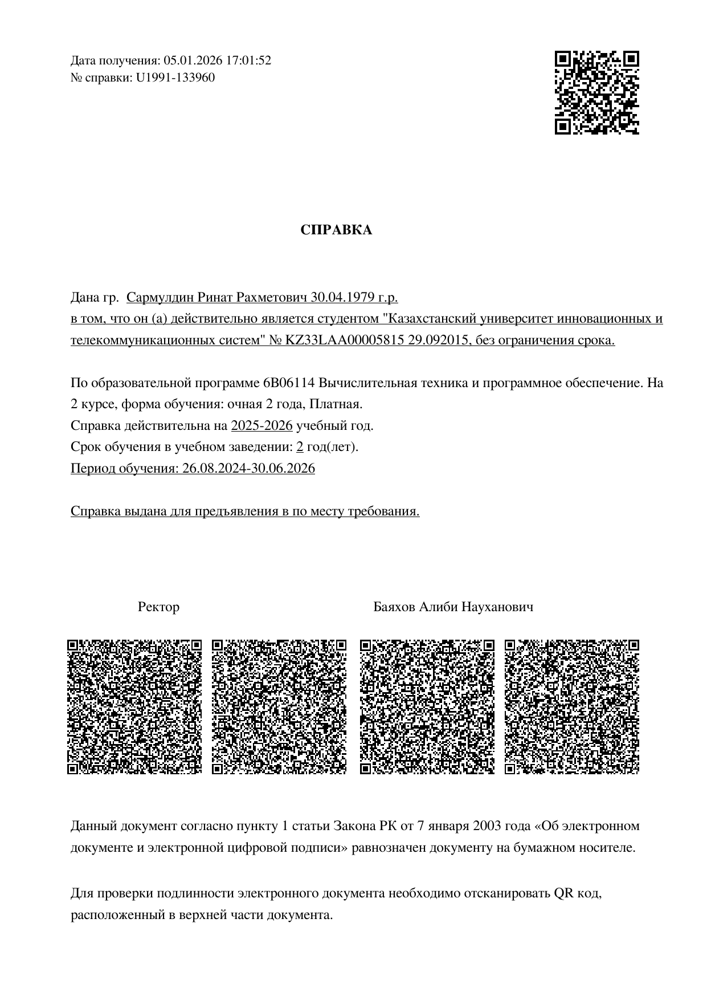

# KAZIITU — учебные материалы
Казахстанский университет инновационных и телекоммуникационных систем  
Бакалавр. Кафедра технических дисциплин. Вычислительная техника и программное обеспечение.

## О репозитории
Собраны материалы по семестрам и дисциплинам: курсовые, зачеты, экзамены, конспекты, практика и вспомогательные документы.

## Быстрая навигация
- [Официальный сайт](#официальный-сайт)
- [Основные папки](#основные-папки)
- [Справка о зачислении](#справка-о-зачислении)

## Официальный сайт

- https://kazuits.edu.kz/ru/

## Основные папки
Ключевые каталоги сгруппированы по типам материалов.

**Семестры и периоды**
- `2_Семестр` — материалы второго семестра
- `2Курс 2025-2026_3 академ.период` — материалы 3-го академического периода

**Дисциплины**
- `DataBases` — базы данных
- `Python` — задания и практика по Python
- `Webdisign` — веб-дизайн
- `webtech` — веб-технологии
- `Engin_and_3DMAX three_dim_ graphics_1` — 3D-графика и инженерная графика
- `Инстр-е средства разраб_прог_1` — инструментальные средства разработки ПО

**Практика и экзамены**
- `tasks_practice_test_demo` — практика и тестовые задания
- `Производ.я практика скан доки` — сканы по практике
- `Экзамены _вопросы_1семестр_В01-ВТ-121` — вопросы к экзаменам
- `экзамены_другие_группы` — экзамены других групп

**Служебное**
- `assets` — изображения для README

## Справка о зачислении

- Открыть PDF: [Справка с Универа 2026.pdf](./Справка%20с%20Универа%202026.pdf)
