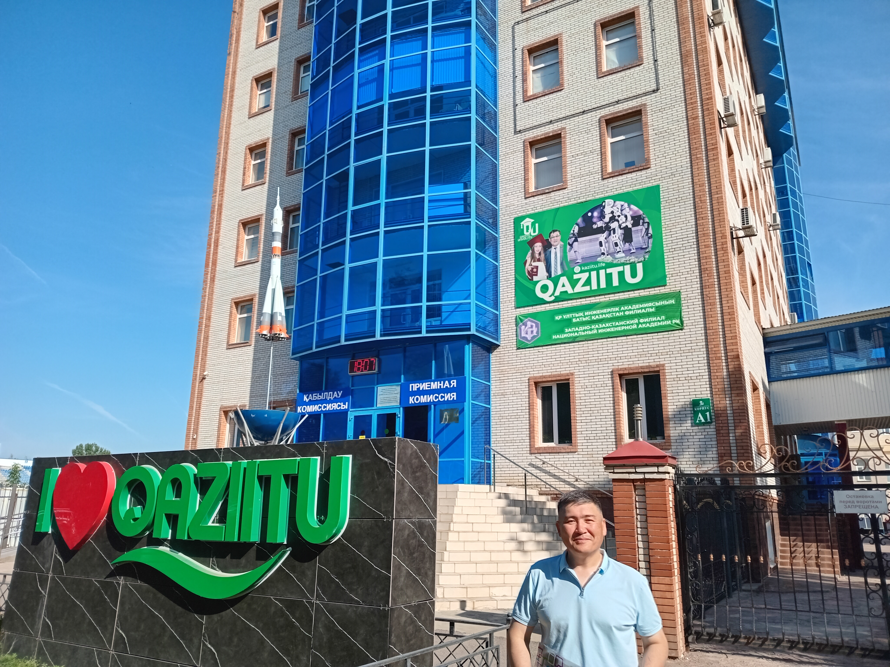
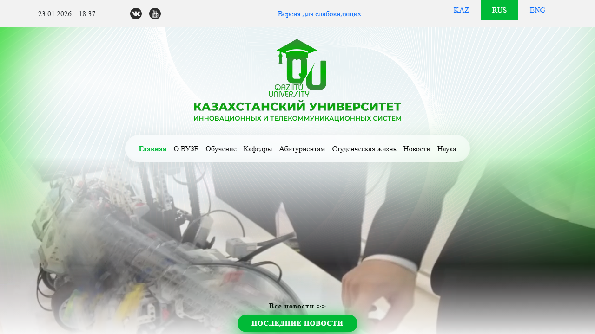
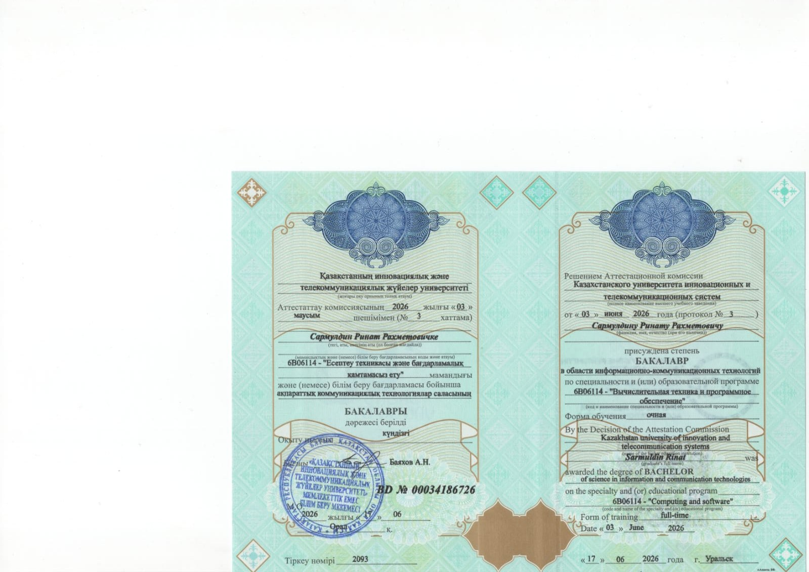
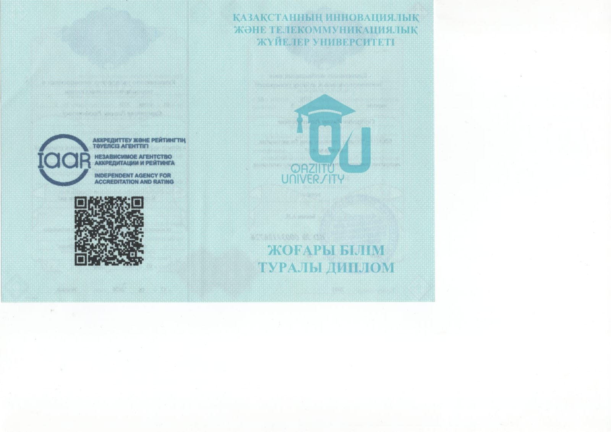
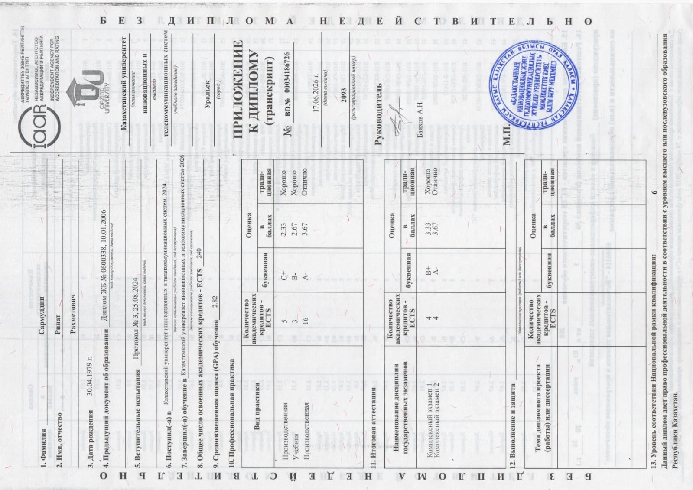
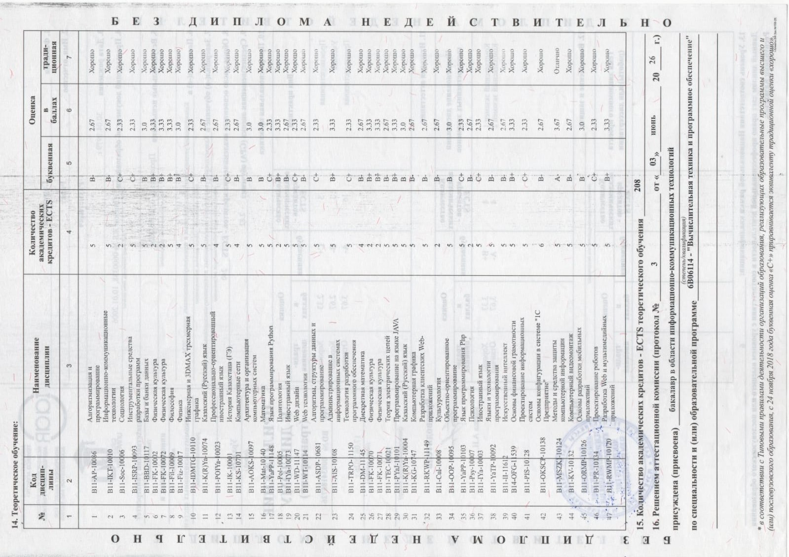

# Казахстанский университет развития и телекоммуникационных систем — учебные материалы
Казахстанский университет инновационных и телекоммуникационных систем
Бакалавр. Кафедра технических дисциплин. Вычислительная техника и программное обеспечение.

## О репозитории
Собраны материалы по семестрам и дисциплинам: курсовые, зачеты, экзамены, конспекты, практика и вспомогательные документы.

## Быстрая навигация
- [Официальный сайт](#официальный-сайт)
- [Основные папки](#основные-папки)
- [Диплом и приложение](#диплом-и-приложение)

## Официальный сайт

- https://kazuits.edu.kz/ru/

## Основные папки
Ключевые каталоги сгруппированы по типам материалов.

**Семестры и периоды**
- `2_Семестр` — материалы второго семестра
- `2Курс 2025-2026_3 академ.период` — материалы 3-го академического периода

**Дисциплины**
- `DataBases` — базы данных
- `Python` — задания и практика по Python
- `Webdisign` — веб-дизайн
- `webtech` — веб-технологии
- `Engin_and_3DMAX three_dim_ graphics_1` — 3D-графика и инженерная графика
- `Инстр-е средства разраб_прог_1` — инструментальные средства разработки ПО

**Практика и экзамены**
- `2026_практика_диплом` — материалы по практике, диплому и государственным экзаменам
- `tasks_practice_test_demo` — практика и тестовые задания
- `Производ.я практика скан доки` — сканы по практике
- `Экзамены _вопросы_1семестр_В01-ВТ-121` — вопросы к экзаменам
- `экзамены_другие_группы` — экзамены других групп

**Служебное**
- `assets` — изображения для README

## Диплом и приложение
Диплом бакалавра по образовательной программе `6B06114 — Вычислительная техника и программное обеспечение`.

**Реквизиты диплома**
- Номер диплома: `BD № 00034186726`
- Регистрационный номер: `2093`
- Решение аттестационной комиссии: протокол № `3` от `03.06.2026`
- Дата оформления диплома: `17.06.2026`, г. Уральск
- Дата получения на руки: `24.06.2026`
- Проверка подлинности: QR-код расположен на второй странице диплома.

### Основная страница

### Страница с QR-кодом для проверки

### Приложение к диплому

